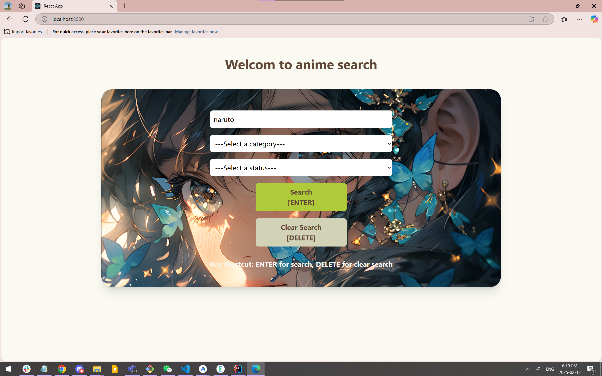
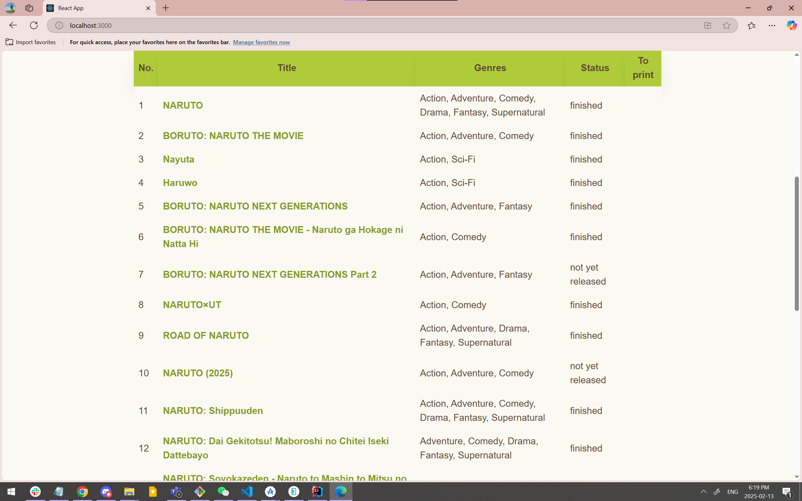
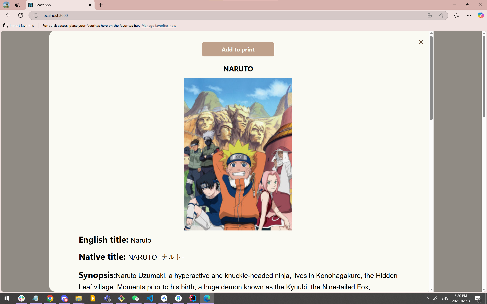
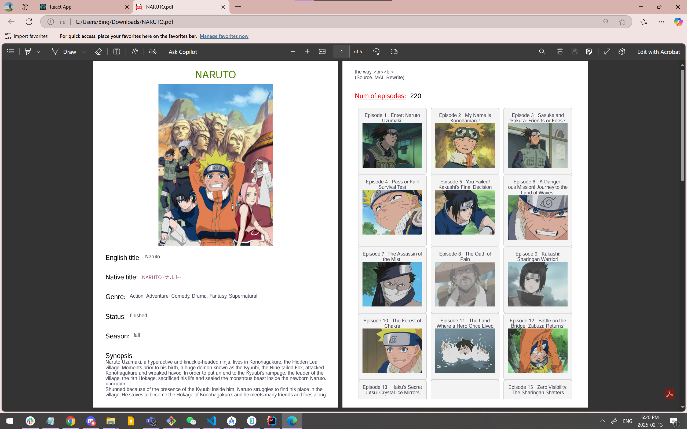

# searchAnime
A website for anime search, supports generating PDF in a friendly format.

## Technologies ##
React · JavaScript · GraphQL query language

1. Front-end project built by accessing the AniList API.
1. Querying its database through the GraphQL query language

## Screenshots ##

### Search and result ###

### Generated PDF ###

## `npm start` ##

Veuillez vous assurer que le port 3000 est disponible.

## `npm run server` ##
Veuillez vous assurer que le port 3001 est disponible.

Ce port est réservé au serveur proxy.
